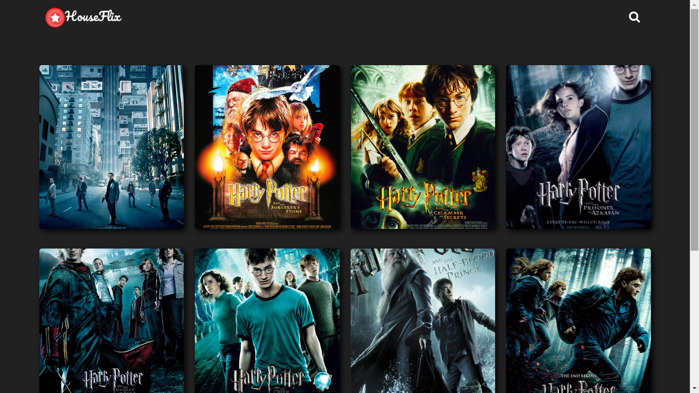
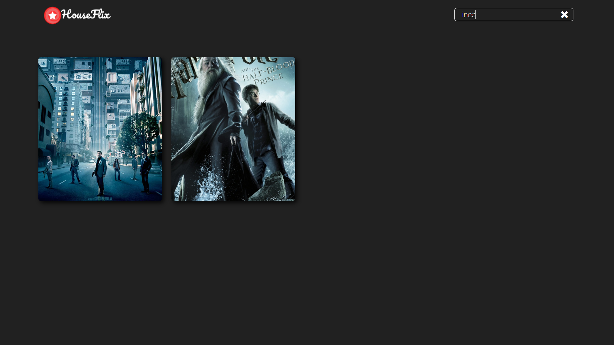

# HouseFlix

A Home Media Server and Video Streaming Service.

## Instructions

1.  Front End is implemented in `FrontEnd` directory. Installation and Setup information is provided in `README.md` of that directory.
2.  Back End is implemented in `MediaServer` directory. Installation and Setup information is provided in `README.md` of that directory.

## Screenshots

### `/browse` route

 
 
 
 

### `/search` route

## Technology Used

1.  ReactJS
2.  NodeJS

## LICENSE

MIT License. License related information can be found at [LICENSE](LICENSE)